# 2022–2026顶会中的网络领域定制硬件设计逻辑整理

## 1. 快速索引

| 推荐度 | 论文 | 顶会 | 设备/问题 | 最值得模仿的图链 | 最强硬件证据 |
|---|---|---|---|---|---|
| A | ACCL+ | OSDI 2024 | FPGA collective engine | 系统 → CCLO engine → DMP | 95 Gb/s；CCLO LUT 12.1%、BRAM 5.7% |
| A | RoCE BALBOA | OSDI 2026 | 开放 100G RoCE FPGA 栈 | 完整协议栈 → flow control/重传/ICRC | 100G；基础栈 1.745 W（post-route 估计） |
| A | Taurus | ASPLOS 2022 | 交换机逐包 ML | 数据面 → MapReduce block → CU | 1 GPkt/s；整芯片面积 +3.8%、功耗 +2.8%（综合） |
| A | Menshen | NSDI 2022 | 多租户 P4 流水线隔离 | 整体流水线 → parser → stage | FPGA LUT 额外 0.15%–0.65%；100G |
| A | SRNIC | NSDI 2023 | 大规模 RDMA NIC | RNIC 总体 → cache-free SQ scheduler | 10K QP、97 Gb/s、3.3 μs、4.4 MB SRAM |
| A | N3IC | NSDI 2022 | NIC 内 BNN 推理 | 离线/在线系统 → BNN executor | 40G；延迟低 10–100×；native 资源增量小 |
| B | Tiara | NSDI 2022 | 异构 L4 load balancer | T-switch/T-NIC/T-server → HBM hash | 1.6 Tb/s、80M flows、1.8M CPS |
| B | Cepheus | HPCA 2024 | RoCE multicast | 协议工作流 → FPGA packet pipeline | 4 条 100G pipeline；LUT 4.8% |
| B | OptimusPrime | SIGCOMM 2024 | 可变形数据面 | transformable block → 三环互连 | ASIC 面积 +5.38%；聚合吞吐最高 1.5× |
| B | Tassel | SIGCOMM 2024 | RNIC rate limiter | 两级限速 → RNIC → timeline 数据结构 | 125 Mpps、16K flows；ALM 4.4% |
| B | RpcNIC | HPCA 2025 | PCIe SmartNIC RPC | 软硬件总图 → 三种跨 PCIe 数据流 | 端到端吞吐 2.6×；LUT 13% |
| B | ClubHeap | NSDI 2025 | PIFO priority queue | 跨层流水 → processor → memory mapping | 约 200 Mpps；ASIC 面积为 BBQ 的 17.7% |

---

## 2. N3IC：Re-architecting Traffic Analysis with Neural Network Interface Cards

- 会议：NSDI 2022
- 设备：可编程 NIC / NetFPGA 上的 BNN 推理单元
- 原文：[会议页](https://www.usenix.org/conference/nsdi22/presentation/siracusano) ｜ [PDF](https://www.usenix.org/system/files/nsdi22-paper-siracusano.pdf)

### 2.1 设计逻辑链

| 环节 | 原文思路 |
|---|---|
| 设计需求 | **NIC 已能提取流量特征**，但若把推理留在 CPU，仍要**跨 PCIe 搬数据并依赖 batching**。原文的 CPU 基线在 0.2M flows/s 时约 42 μs，升到 1M flows/s 后超过 800 μs；与此同时，NIC 数据面要求线速、确定性时延和很小的片上状态。 |
| 设计原则 | 选择与位级硬件天然匹配的 Binary Neural Network：权重和激活均为 1 bit，把乘加改写成 XNOR/XOR、popcount 和 sign；权重保存在 BRAM；同一模型既可编译到 micro-C/P4，也可落到 native HDL primitive。 |
| 硬件设计 | 离线阶段完成量化、模型搜索和 target-specific 编译；在线阶段把 feature extraction、网络功能和 BNN inference 放在同一 NIC 数据面。native BNN executor 由多个 layer block 串接，每个 block 明确分成取权重/XOR、并行 popcount、累加/sign 三个 stage。 |
| 实验闭环 | **实测**：40 Gb/s line rate；相对软件分类器吞吐提高 1.5–7×、分类时延降低 10–100×。p95 时延约为 NFP 42 μs、P4 2 μs、native FPGA 0.5 μs。资源表中 simple feature extractor 为 50.0k LUT/258 BRAM，加入 native BNN 后为 52.6k LUT/275 BRAM；P4 版本则为 145.1k LUT/582 BRAM。 |

### 2.2 图：先交代模型如何进入设备

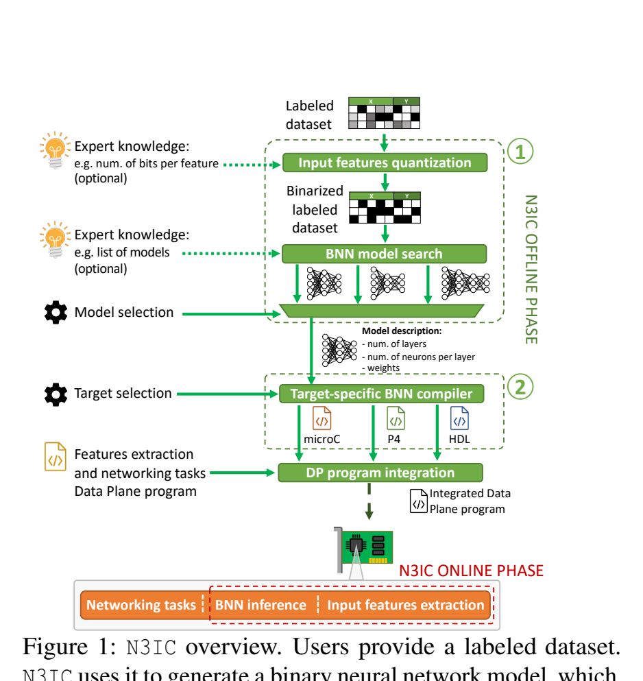

原图为 Fig.1，PDF p.3。它把图纵向分成两段：上半段是离线量化、搜索、编译，下半段是在线数据面。最值得模仿的是“产物逐级变形”的表达：dataset → binarized dataset → model description → target program → NIC pipeline，而不是只画一个模糊的“compiler”方框。

画类似图时，可以保留三个视觉层次：

1. 左侧写输入约束和专家知识；
2. 中间画编译/搜索流水及其产物；
3. 用明显边界标出真正在线运行的硬件范围。

### 2.3 图：把一个神经网络层拆成可执行流水

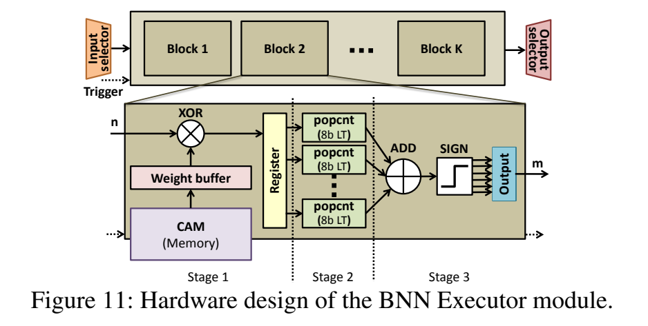

原图为 Fig.11，PDF p.9。这张图同时展示了两级层次：上方是 Block 1…K 的网络层级联，下方是一个 block 内部的三阶段流水。它还显式画出 CAM/weight buffer、寄存器边界、并行 popcount、ADD、SIGN 以及输入/输出宽度 `n`、`m`。

这类图可直接模仿的规则是：**状态存在哪里、组合运算在哪里、stage 在哪里切开、位宽如何变化**，四件事都要能一眼找到。

### 2.4 可学习的工作总结

N3IC 的核心不是“把任意 ML 搬上 NIC”，而是先选择一种能把昂贵乘加退化成位操作的模型，再围绕 NIC 的 BRAM、LUT 和固定流水重新定义执行原语。写作上，它用“CPU 数据搬运/批处理瓶颈 → BNN 表示选择 → 三级 executor → native 与 P4 资源对照”形成了很强的因果闭环。

---

## 3. Tiara：A Scalable and Efficient Hardware Acceleration Architecture for Stateful Layer-4 Load Balancing

- 会议：NSDI 2022
- 设备：Tofino 交换机 + FPGA SmartNIC/HBM + x86 server
- 原文：[会议页](https://www.usenix.org/conference/nsdi22/presentation/zeng) ｜ [PDF](https://www.usenix.org/system/files/nsdi22-paper-zeng.pdf)

### 3.1 设计逻辑链

| 环节 | 原文思路 |
|---|---|
| 设计需求 | 边界负载均衡器目标超过 1 Tb/s、10M concurrent flows 和 1M CPS。10M 条、每条约 64 B 的 connection table 已约 640 MB，而交换芯片通常只有 50–100 MB SRAM，entry insertion 也远慢于目标 CPS；又不能依赖“少数长流覆盖大部分流量”的假设。 |
| 设计原则 | 不让一种器件同时承担所有任务，而按瓶颈类型映射：吞吐密集、状态少的 encap/decap 放 Tofino；容量/随机访问密集的 lookup 和 connection management 放 FPGA+HBM；罕见 slow path 与完整控制状态放 x86。跨层只传必要 metadata。 |
| 硬件设计 | T-switch、T-NIC、T-server 形成三级结构；T-NIC 内多个 SMux 和 HBM OCT 承担 fast path。OCT 使用 fixed-length hash chaining，把表的宽度映射到并行 HBM channel pair；另用 lock-free offloading engine 和访问 bitmap 完成插入、删除与老化。 |
| 实验闭环 | **实测**：单 T-NIC 200 Gb/s、10M flows、低于 4 μs；8 卡扩展到 1.6 Tb/s、80M flows，达到 1.8M CPS。16M×2 HBM hash 结构约 97.15 Gb/s/port，单 offload engine 达 6.8M ops/s。相对 SMux，latency-bounded throughput 为 42.1×、P99 低 25×；等目标吞吐部署下 cost/energy/space efficiency 分别高 17.4×/12.8×/16.8×。 |

### 3.2 图：用路径颜色解释异构任务映射

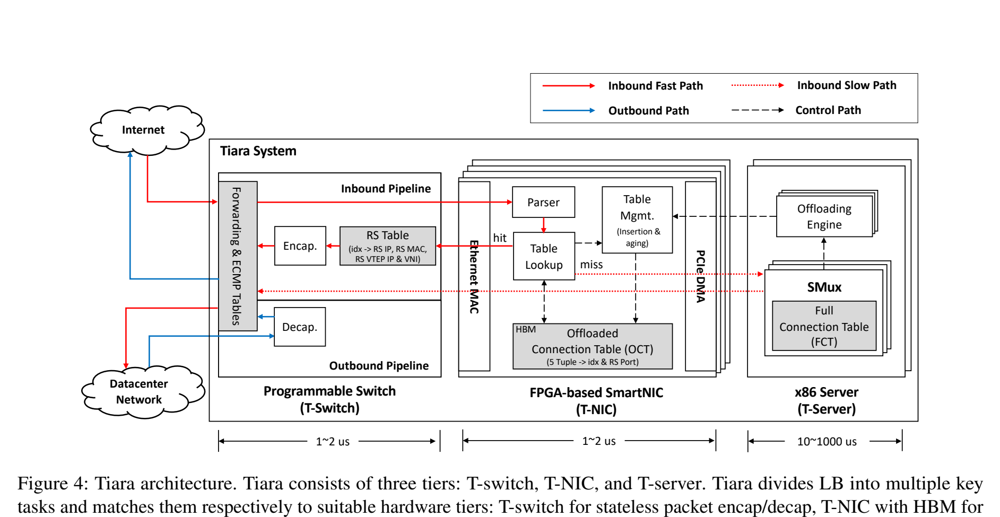

原图为 Fig.4，PDF p.5。图中先用大边界划分 T-switch、T-NIC、T-server，再用红/蓝实线表示 inbound/outbound fast path，用虚线表示 slow/control path。每个器件下方还给出约数量级时延，让“为什么这样分工”不仅是文字判断，也在图中体现。

模仿时应避免只把三类器件并排摆放；要把**哪类包走哪条路径、在哪次 lookup 命中/未命中后分叉、状态由谁拥有**画出来。

### 3.3 图：让数据结构形状对应物理内存并行度

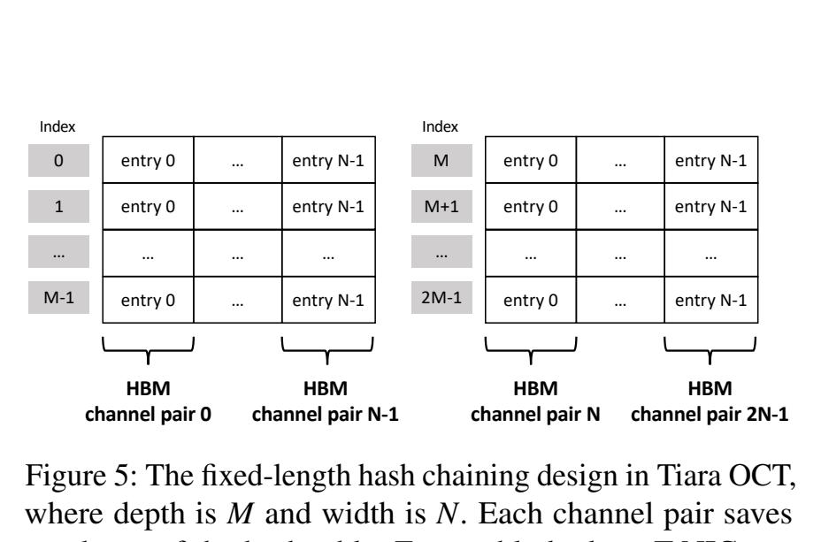

原图为 Fig.5，PDF p.7。它没有停留在“使用 HBM”这一层，而是说明 hash table 的深度 `M`、宽度 `N` 如何映射到 HBM channel pair，使一次查询可以并行读取多个 entry。

这类图适合模仿成“逻辑数据结构 → 物理 bank/channel → 单次访问并行度”的映射图。它能直接支撑后面的 channel 参数扫描与 97 Gb/s lookup 结果。

### 3.4 证据边界与总结

17.4×/12.8×/16.8×是同目标吞吐下的**系统部署比较**，不是一颗 FPGA 芯片的实测功耗；Silkroad 在纯 Mbps/W 上更高，但连接规模和 CPS 目标不同。Tiara 最值得学习的是：先把每个子任务按“带宽、容量、控制复杂度”分类，再映射到器件原生长项，并用 metadata contract 把各层连成 fast/slow path。

---

## 4. Taurus：A Data Plane Architecture for Per-Packet ML

- 会议：ASPLOS 2022
- 设备：带 MapReduce/SIMD block 的可编程交换 ASIC
- 原文：[作者版 PDF](https://arxiv.org/pdf/2002.08987) ｜ [DOI](https://doi.org/10.1145/3503222.3507726)

### 4.1 设计逻辑链

| 环节 | 原文思路 |
|---|---|
| 设计需求 | 传统 match-action/VLIW 数据面缺少 loop、multiply 等 ML 所需能力；控制平面响应通常超过 10 μs，外接加速器还会引入链路与 batching 时延。目标是在交换机内对每个包推理，同时保持普通包的 line-rate fast path。 |
| 设计原则 | 用比通用 CPU 更受限、但能覆盖多类 ML 的 MapReduce 抽象；使用空间 SIMD、编译期 loop unrolling、8-bit fixed point 和片上 SRAM；非 ML 报文必须可以 bypass。设计参数把 lane、stage、精度与面积/功耗放在同一搜索空间。 |
| 硬件设计 | parser 后接 pre-processing MAT、MapReduce、post-processing MAT 和 scheduler；header、packet body 与非 ML 包有独立 bypass/queue。MapReduce block 采用 MU/CU checkerboard，CU 内再分为 FU + pipeline register 的三级流水和最终 reduction。 |
| 实验闭环 | **ASIC 综合/模型**：15 nm、1 GHz；KMeans/SVM/DNN 均达到 1 GPkt/s，时延 61/83/221 ns，面积 0.3/0.6/1.0 mm²，功耗 177/395/647 mW。12×10 grid 为 4.8 mm²；相对论文采用的 500 mm²、270 W 交换芯片模型，整芯片面积 +3.8%、功耗 +2.8%。LSTM 为 805 ns、3.0 mm²、1897 mW，但不是 1 GPkt/s 模型。 |

### 4.2 图：先画完整数据面和所有旁路

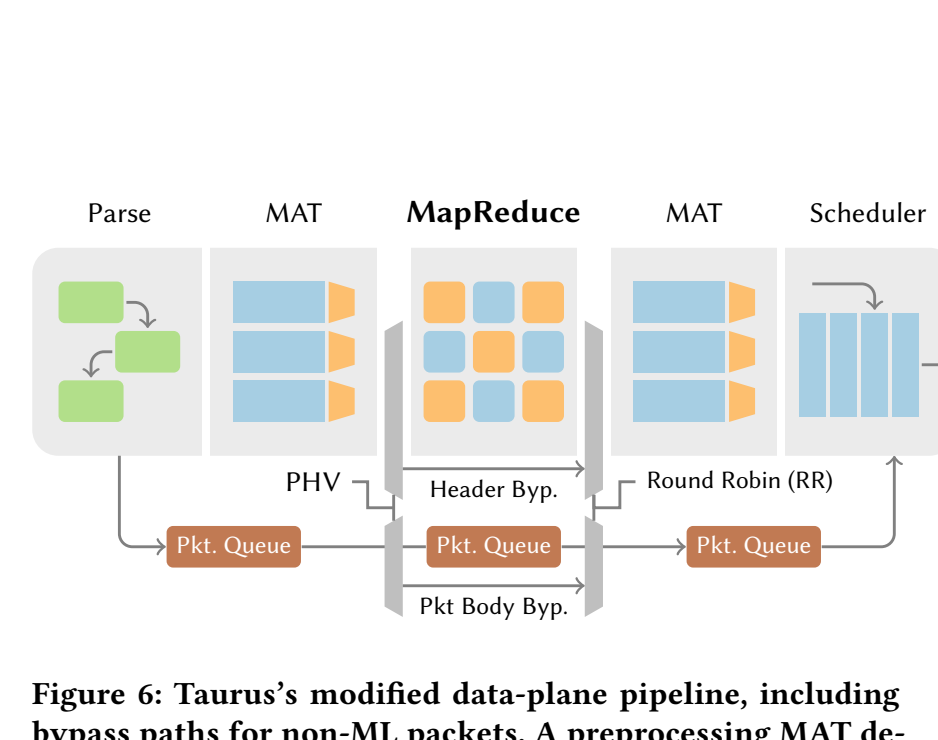

原图为 Fig.6，PDF p.6。除了主计算链，它把 header bypass、packet body bypass、三个 packet queue 和 round-robin 合流都画出来。这样读者不会误以为所有包都必须穿过 ML block，也能看出引入新模块后原交换语义如何保持。

### 4.3 图：从 block 下钻到 compute unit

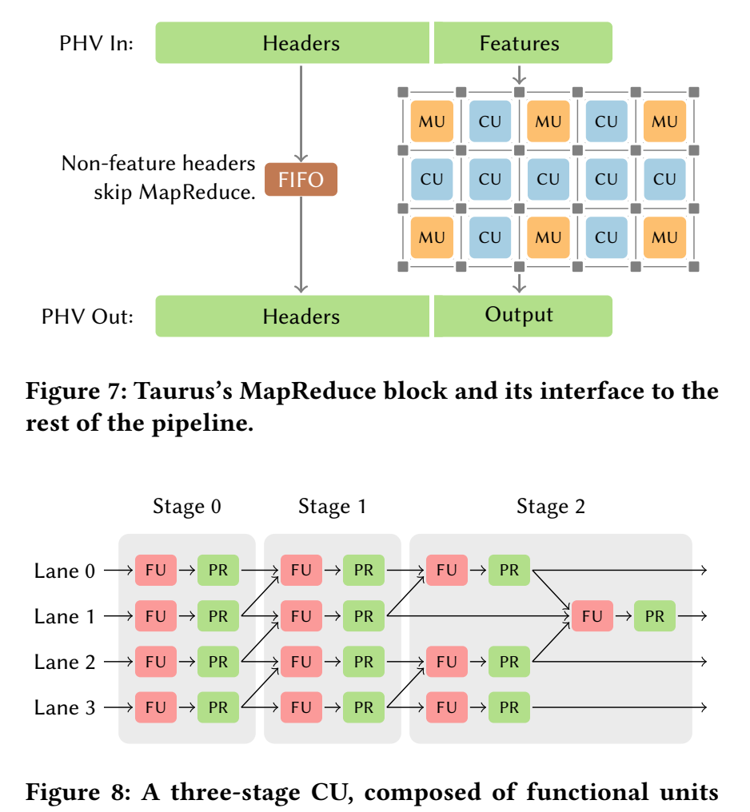

原图为 Fig.7、Fig.8，PDF p.6。Fig.7 表达 PHV 中 headers/features 的分离、MU/CU 阵列和 non-feature header FIFO；Fig.8 再把一个 CU 拆成 lane、FU、pipeline register 和 reduction path。

这是非常标准的三级画法：

1. 整条交换 pipeline；
2. 新增计算 block 及其外部接口；
3. block 内的单元和 stage。

### 4.4 可学习的工作总结

Taurus 先从工作负载规律提炼“足够通用但可高效实现”的最小执行模型，而不是把完整 CPU 塞进交换机。实验也不是只给一个吞吐数字，而是把每个模型的时延、面积、功耗，以及整芯片相对开销放在同一表中。需要注意，这些面积/功耗是综合与芯片模型结果，不是流片测量。

---

## 5. Menshen：Isolation Mechanisms for High-Speed Packet-Processing Pipelines

- 会议：NSDI 2022
- 设备：支持多租户隔离的 RMT/P4 FPGA/ASIC pipeline
- 原文：[会议页](https://www.usenix.org/conference/nsdi22/presentation/wang-tao) ｜ [PDF](https://www.usenix.org/system/files/nsdi22-paper-wang_tao.pdf)

### 5.1 设计逻辑链

| 环节 | 原文思路 |
|---|---|
| 设计需求 | 多个独立 P4 module 共用一条空间数据流 pipeline 时，必须同时保证 behavior、performance、resource isolation，并允许一个 module 快速重配置而不暂停其他 module。传统 OS/hypervisor 的时间复用思路不能直接套到 line-rate RMT。 |
| 设计原则 | 容易切分且数量充足的资源做空间 partition；不适合切分的共享资源增加轻量 per-module overlay table；让 module ID/VID 随包贯穿 parser、match-action、state memory 与 deparser；配置路径和 packet path 分开。 |
| 硬件设计 | 在基线 RMT 上加入 packet filter、module-aware parser action、key extractor/mask table、带 module ID 的 match key、VLIW action、segment table 地址翻译和 module-aware deparser。并行 parser/deparser、packet buffer 和 deeper pipeline 用于掩盖配置读取时延。 |
| 实验闭环 | **FPGA 实测/资源报告**：5-stage RMT→Menshen，NetFPGA LUT 200,573→200,733、BRAM 均为 641；Corundum LUT 235,686→235,903、BRAM 均为 316，即 LUT 额外 0.65%/0.15%。Corundum 上对至少 256 B 报文达到 100 Gb/s，满速时约 1.2 μs；重配置一个 module 时其他 module 吞吐不受影响。**45 nm 综合**：10.81 vs 9.71 mm²，pipeline block +11.4%；按 pipeline 占芯片不超过 50% 推算整芯片约 +5.7%。 |

### 5.2 图：用颜色标出“基线、修改、新增”

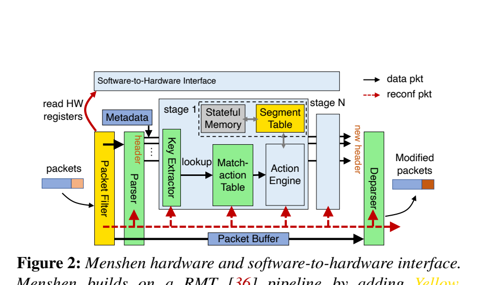

原图为 Fig.2，PDF p.5。它沿着 packets → parser → stages → deparser 画出完整流水，并用颜色区分原 RMT、修改模块和新增模块；重配置包走红色虚线路径，普通数据包走黑色路径。

这种“基线图上做差分”的方式非常适合体系结构论文：读者能立即看到创新落在哪些模块，也不会把已有硬件误当成贡献。

### 5.3 图：把隔离原则逐项落实到表和 tag

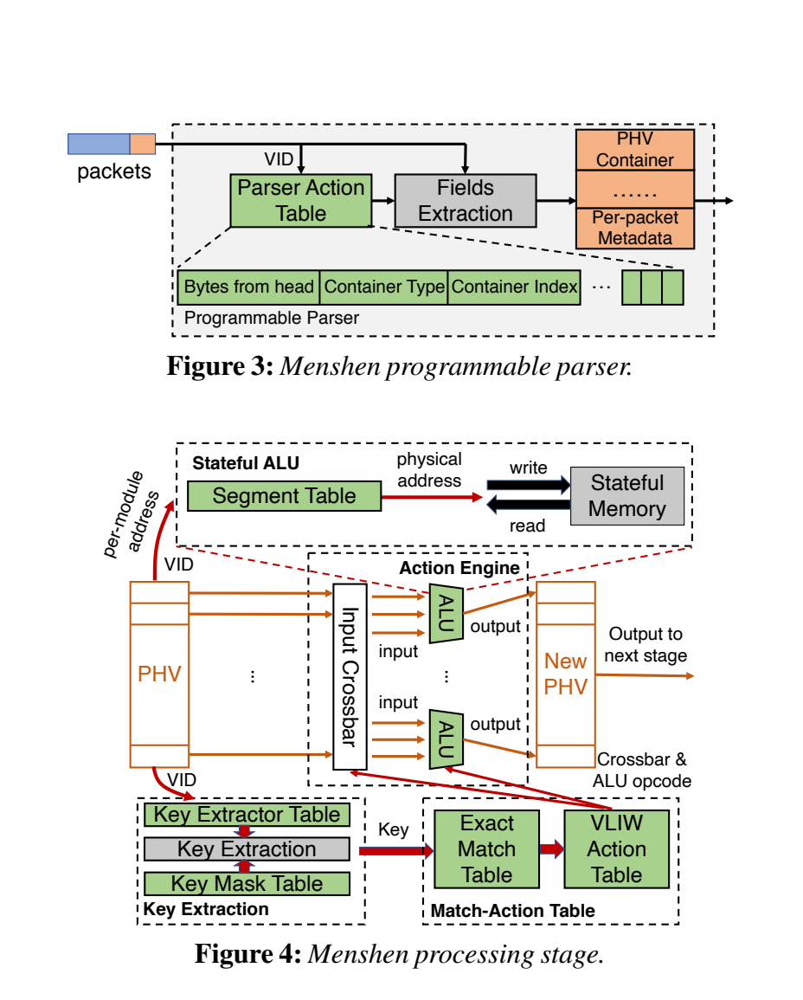

原图为 Fig.3、Fig.4，PDF p.5。parser 用 VID 索引 Parser Action Table；stage 内 VID 同时驱动 segment table、key extractor/mask、match/action 和新 PHV。每个“隔离原则”都对应一个具体 tag、table 或 address translation，而不是只写一句“we provide isolation”。

### 5.4 可学习的工作总结

Menshen 的方法可以概括为：先给每类共享资源做“partition 还是 overlay”的决策，再用一个紧凑 module ID 贯穿全流水。评价也分别证明行为隔离、重配置不中断、线速和资源开销。ASIC 5.7% 是由局部综合结果进一步推算的整芯片比例，引用时必须保留这一证据边界。

---

## 6. SRNIC：A Scalable Architecture for RDMA NICs

- 会议：NSDI 2023
- 设备：面向大连接规模和有损网络的 FPGA RNIC
- 原文：[会议页](https://www.usenix.org/conference/nsdi23/presentation/wang-zilong) ｜ [PDF](https://www.usenix.org/system/files/nsdi23-wang-zilong.pdf)

### 6.1 设计逻辑链

| 环节 | 原文思路 |
|---|---|
| 设计需求 | 商用 RNIC 在 QP 数量超过片上 cache 容量后会 thrash，性能连接数通常只有数百；PFC 又限制网络扩展。若直接为 10K QP 保留传统状态，WQE cache 9.8 MB、selective-repeat bitmap 3.0 MB、reorder buffer 4.9 GB、outstanding request table 114.4 MB，远超片上预算。 |
| 设计原则 | 高频、顺序、简单的 common case 留在硬件 fast path；低频丢包和 out-of-order metadata 交给 CPU slow path；尽可能把大状态放 host memory，并用批量 PCIe 请求隐藏往返延迟；优先把片上 SRAM 留给真正决定 active QP 性能的 QPC。 |
| 硬件设计 | cache-free SQ scheduler 用 Event Mux 汇集 doorbell、credit update 和 dequeue 事件，只把 ready QP 放入很小的 schedule queue；DMA 每次批量取 WQE/data，未用 WQE 不驻留片上。header extension 消除 reorder buffer/ORT，bitmap-onloading 把大 bitmap 搬到 host，只保留 CtrlQ/RetryQ 元数据。 |
| 实验闭环 | **FPGA 实测**：300 MHz、PCIe Gen3×16、100GbE；10K QP 只用 4.4 MB SRAM，达到 97 Gb/s、3.3 μs，CPU 开销低于 5%。按 performant QP/MB 归一化，比 ConnectX-5 高 18×；1% loss 下仍有约 75 Gb/s goodput，而 CX-6 约 25 Gb/s。资源为 101,102 LUT、140,816 registers、621 BRAM、48 URAM。 |

### 6.2 图：fast/slow path 必须贯穿 CPU、PCIe 和 RNIC

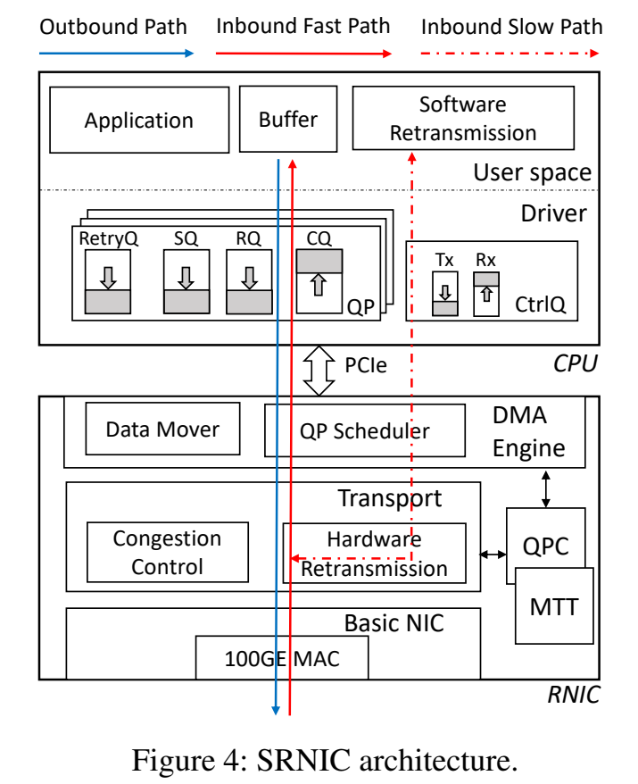

原图为 Fig.4，PDF p.7。图用蓝色、红色实线和红色虚线分别画 outbound、inbound fast path 和 inbound slow path；CPU/driver、PCIe、DMA、transport、retransmission、QPC/MTT 的所有权边界都很清楚。

画 fast/slow path 时，应让同一种颜色真正穿过各层，而不是只在图例中宣称有快慢路径。这样读者才能检查“异常在哪里上送、正常路径是否被 CPU 打断”。

### 6.3 图：用事件和 ready queue 代替大 WQE cache

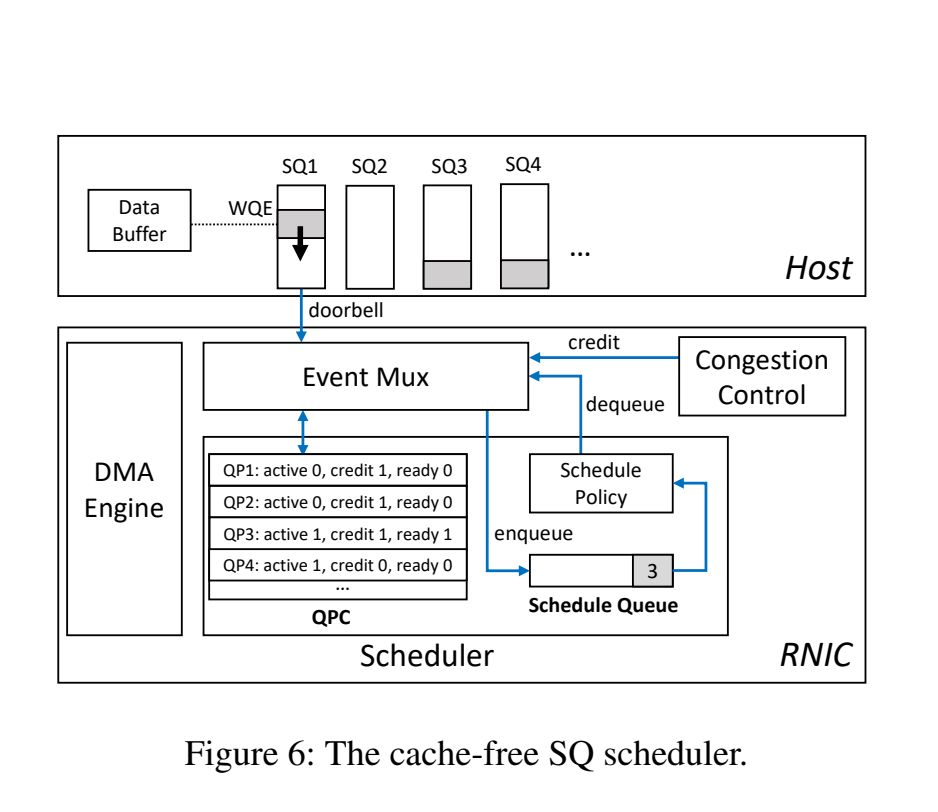

原图为 Fig.6，PDF p.8。它把 host SQ/WQE、doorbell、Event Mux、credit、QPC ready bits、Schedule Policy、Schedule Queue、DMA/Data Buffer 连成闭环。相比只画一个“Scheduler”方框，这张图解释了谁产生事件、何时入队、何时触发 DMA，以及拥塞控制如何反馈。

### 6.4 可学习的工作总结

SRNIC 的套路是先做一张“状态容量账本”，再逐项消表：WQE cache 用无缓存调度消掉，bitmap 放 host，reorder buffer/ORT 用协议头扩展消掉。它利用 common/rare path 的不对称性，在不把整个 transport 搬回软件的前提下获得连接规模和有损网络能力。

---

## 7. ACCL+：an FPGA-Based Collective Engine for Distributed Applications

- 会议：OSDI 2024
- 设备：可切换协议和 collective schedule 的 FPGA engine
- 原文：[会议页](https://www.usenix.org/conference/osdi24/presentation/he) ｜ [PDF](https://www.usenix.org/system/files/osdi24-he.pdf)

### 7.1 设计逻辑链

| 环节 | 原文思路 |
|---|---|
| 设计需求 | FPGA collective 既要支持 UDP/TCP/RDMA、message/streaming、host/FPGA kernel，又要能在运行时更换 collective 算法；若每次改变 schedule 都重新综合，会耗时数小时。纯 uC 控制虽然灵活，却会被串行执行和较低频率限制。 |
| 设计原则 | 原文明确定义 G1–G5：标准 collective API、运行时算法灵活性、跨 FPGA/platform 可移植、多种 transport、高吞吐低时延。实现上把平台/协议变化隔离到 adapter，把可变策略放 uC，把稳定且高带宽的数据移动原语放并行硬件。 |
| 硬件设计 | 系统层由 host driver、shell/POE adapters、CCLO engine 和 application kernel 组成。CCLO 内控制面含 micro-controller、RxBuf Manager、Data Movement Processor；数据面含 Rx/Tx system、on-chip network、reduction/compress plugin。DMP 解码 microcode，三路 operand/result command 并行，并负责 align、retire 和 memory/Tx 控制。 |
| 实验闭环 | **FPGA 实测**：100G RDMA 下 send/recv 峰值 95 Gb/s。10 张 U55C 的 DLRM 相对 32-vCPU TensorFlow，时延低两个数量级以上、吞吐高一个数量级以上。资源表中 CCLO 为 LUT 12.1%、DSP 1.6%、BRAM 5.7%、URAM 0；TCP POE 另用 LUT 19.8%/BRAM 10.6%，RDMA POE 另用 LUT 13.0%/BRAM 5.3%。 |

### 7.2 图：系统边界先于 engine 细节

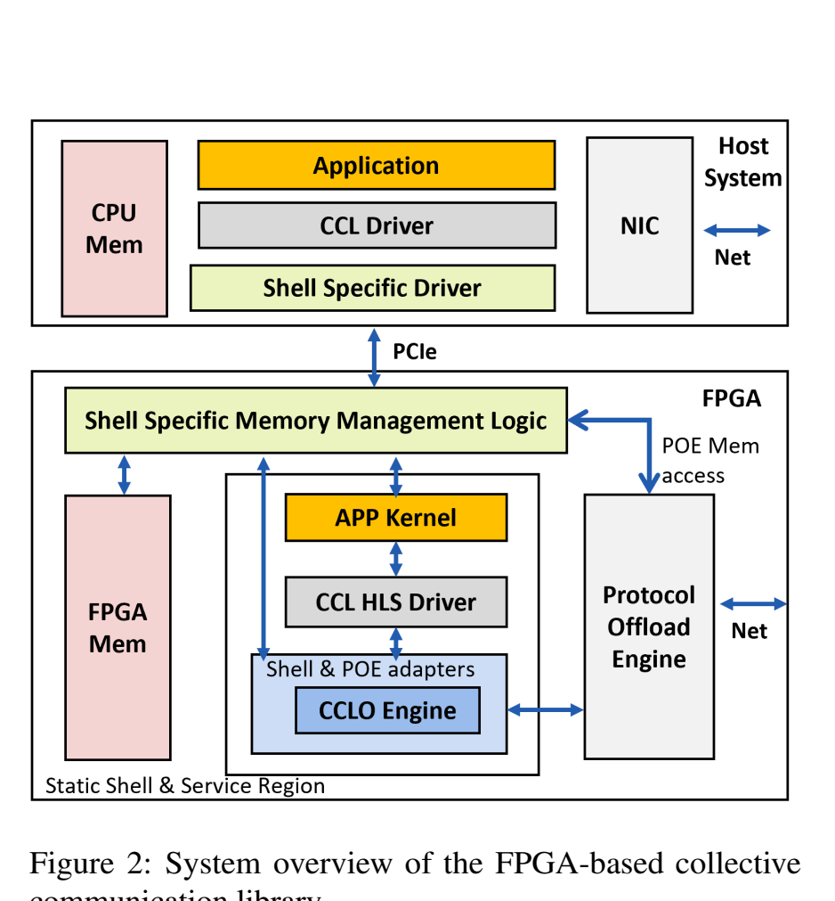

原图为 Fig.2，PDF p.5。上层是 host system，下层是 FPGA static shell/service region；PCIe、memory access、network 和 kernel interface 都有独立箭头。它先回答“CCLO 放在哪里、谁调用、如何接协议”，再进入内部结构。

### 7.3 图：明确区分控制路径和数据路径

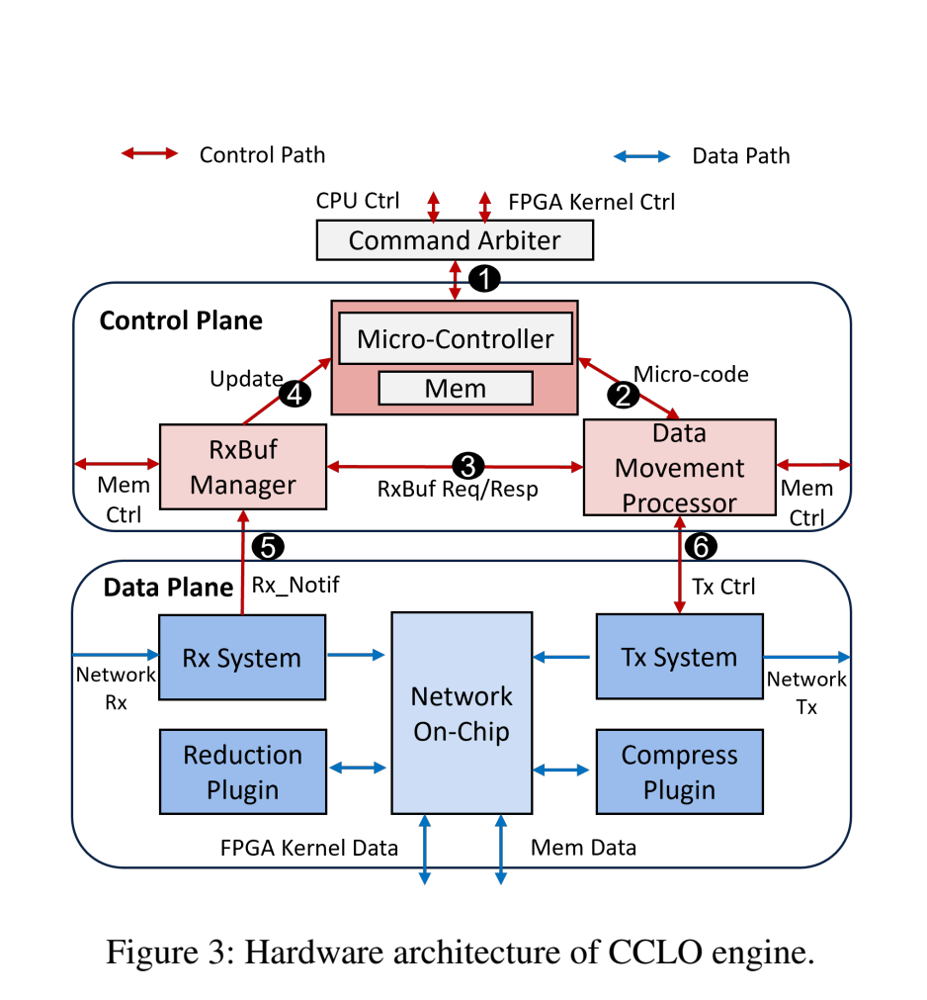

原图为 Fig.3，PDF p.6。红色是 control path，蓝色是 data path；编号 1–6 给出从命令仲裁、microcode、Rx buffer 到 Tx control 的交互顺序。图中不仅有模块名，也把 `Rx_Notif`、`Tx Ctrl`、`Mem Ctrl` 等接口语义写出来。

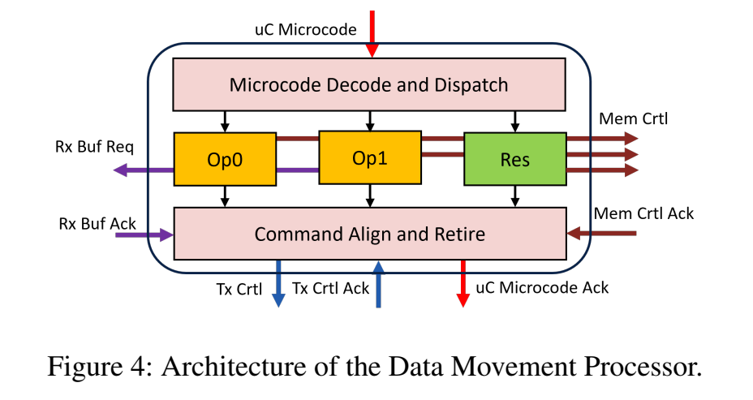

原图为 Fig.4，PDF p.6。DMP 下钻图展示 microcode decode/dispatch、Op0/Op1/Res、command align/retire，以及 request/ack。它解释了为什么 uC 可以保持灵活，而高带宽数据操作不必由 uC 串行执行。

### 7.4 证据边界与总结

CCLO、POE 和应用 kernel 的资源是分开报告的，不能把 12.1% LUT 当成整个系统。部分 host collective 受 XRT 路径和算法选择限制，并非所有 message size 都胜过 MPI。ACCL+ 最值得模仿的是：把“部署后经常变化的 schedule”留在固件，把“必须持续跑满的 data movement”固定为并行 primitive，再用 adapter 封装平台差异。

---

## 8. Cepheus：Accelerating Datacenter Applications with High-Performance RoCE-Capable Multicast

- 会议：HPCA 2024
- 设备：RoCE multicast FPGA network accelerator
- 原文：[作者版 PDF](https://hydrazeng.github.io/pubs/2024/cepheus-hpca24.pdf)

### 8.1 设计逻辑链

| 环节 | 原文思路 |
|---|---|
| 设计需求 | RoCE/QP 原本是一对一语义。直接使用 network multicast 后，一份 data 会产生多路 ACK/NACK/CNP，破坏连接状态、重传和拥塞控制，并可能产生 feedback implosion；同时希望不修改商用 RNIC。 |
| 设计原则 | 保留 endpoint RoCE 语义，只在网络中做必要的 connection bridging、header rewrite 和 feedback aggregation；分层保存 group/path state；发送端仍只看到一条兼容的反馈流。 |
| 硬件设计 | MFT registration 建立 multicast forwarding tree；leaf accelerator 把 multicast ID 映射到各 receiver 的 IP/QPN，数据路径执行 duplicate 和 connection bridging；反馈路径聚合 ACK/NACK、过滤 CNP。MFT 用 Path Index + Path Table 分离 group 与端口/next-hop 状态。 |
| 实验闭环 | **FPGA 实测**：四条 packet pipeline，每条可处理 100 Gb/s interface；总计 53,169 LUT（4.8%）、15,391 registers（0.7%）、188 BRAM（4.9%）。小消息 MPI_Bcast 相对 Chain/BT 时延低约 3–5.2×/2.5–3.5×；大消息吞吐提高约 1.3–2.8×/2–2.8×。存储 replication throughput 提高 2.7×，HPL completion time 最多降低 12%。 |

### 8.2 图：把协议的三个阶段画成连续故事

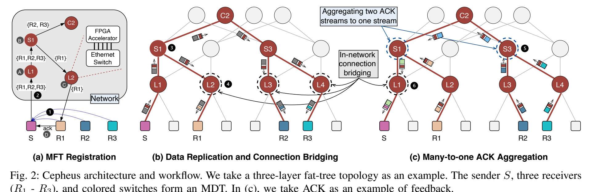

原图为 Fig.2，PDF p.4。三个子图复用相同拓扑，依次展示 MFT registration、data replication/connection bridging、many-to-one ACK aggregation。相同节点位置保持不变，只改变活跃路径和注释，读者能追踪状态如何建立并被数据/反馈使用。

### 8.3 图：把协议动作落到 FPGA 模块

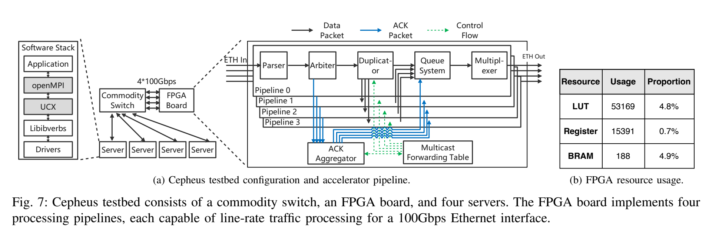

原图为 Fig.7，PDF p.8。右侧 pipeline 明确包含 Parser、Arbiter、Duplicator、Queue System、Multiplexer、ACK Aggregator 和 Multicast Forwarding Table，并用不同颜色表示 data、ACK、control flow；旁边直接放资源小表，使“功能图”和“成本图”靠在一起。

### 8.4 可学习的工作总结

Cepheus 的图链从跨交换机协议工作流，下钻到状态表和 FPGA packet pipeline，特别接近“模块交互 + 数据流变化”的参考风格。其资源结论只针对 FPGA 原型，没有实测 ASIC 面积或芯片功耗；论文对 ASIC 的讨论应视为可行性分析。

---

## 9. OptimusPrime：Unleash Dataplane Programmability through a Transformable Architecture

- 会议：SIGCOMM 2024
- 设备：可在 pipeline stage 与 run-to-completion core 之间变形的数据面
- 原文：[作者版 PDF](https://cs.stanford.edu/~keithw/sigcomm2024/sigcomm24-final12-acmpaginated.pdf) ｜ [DOI](https://doi.org/10.1145/3651890.3672214)

### 9.1 设计逻辑链

| 环节 | 原文思路 |
|---|---|
| 设计需求 | pipeline 吞吐高，但不擅长长依赖、复杂 stateful computation、feedback 和大表；run-to-completion core 灵活，但吞吐、功耗和面积较差。固定比例的 hybrid 又会因应用不同而浪费某一侧资源，任意 crossbar 也难扩展。 |
| 设计原则 | 找出两类执行单元可共享的 register array、ALU/SALU、data/instruction memory，把它们封装成 transformable block；只保留少量 mode-specific 组件。互连使用普通 pipeline chain、outer ring 和 inner ring，而不是全连接 crossbar；compiler 决定每个 block 的角色。 |
| 硬件设计 | pipeline mode 通过 Match/Action ID/VLIW 驱动共享数据通路；RTC mode 通过 Decoder/PC/instruction memory 驱动同一 ALU 和 register array。全芯片的 normal path 连接 parser→MAU→deparser，outer ring 运送绕行 PHV，inner ring负责 core、memory 和 accelerator 间通信。 |
| 实验闭环 | **FPGA/ASIC 综合**：相对基线 block，transformable block 额外 LUT 13.12%、FF 15.72%、BRAM 3.03%；45 nm 整体面积 100.70→106.12 mm²，即 +5.38%。**FPGA 原型**：parameter aggregation 达约 990 Gb/s 基线能力，并相对 pure pipeline 提高最高 1.5×；混入 background traffic 时 pure pipeline 因 recirculation 下降约 1/3，而 OptimusPrime 基本不受影响。网络功能集成中，pure pipeline 第一次 recirculation 即使吞吐约减半，OptimusPrime 随功能增加下降更缓。 |

### 9.2 图：用颜色表达可共享和 mode-specific 组件

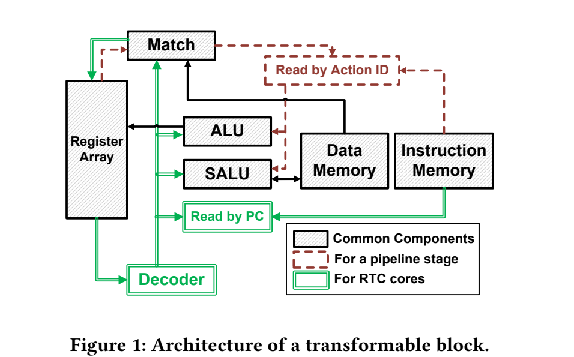

原图为 Fig.1，PDF p.4。灰色斜纹是两种模式共享组件，红色虚线是 pipeline mode，绿色是 RTC mode。相同模块上的两套驱动路径直接说明“复用在哪里、额外硬件在哪里”。

### 9.3 图：用最小互连支持三种通信语义

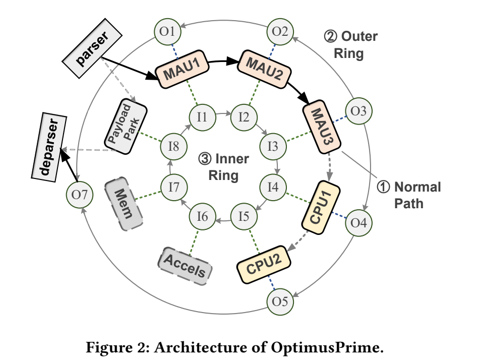

原图为 Fig.2，PDF p.5。普通 packet pipeline 沿外圈 MAU 前进；需要 RTC 的 PHV 通过 outer ring 进出 CPU core；core 之间和共享 memory/accelerator 通过 inner ring。图没有画成任意连线，而是把三类通信约束成可实现的拓扑。

### 9.4 证据边界与总结

1.5×来自特定 parameter aggregation 配置，不应概括成所有 workload 的统一加速倍数；网络功能集成更适合用“避免 recirculation 导致的吞吐断崖”来表达。OptimusPrime 的可模仿点是：先找两类架构的公共 datapath，再以少量 mode-specific 控制和简单互连实现运行前资源重分配。

---

## 10. Tassel：Fast, Scalable, and Accurate Rate Limiter for RDMA NICs

- 会议：SIGCOMM 2024
- 设备：RNIC 内的分层 rate limiter / scheduler
- 原文：[作者版 PDF](https://cse.hkust.edu.hk/~kaichen/papers/tassel-sigcomm24.pdf) ｜ [DOI](https://doi.org/10.1145/3651890.3672215)

### 10.1 设计逻辑链

| 环节 | 原文思路 |
|---|---|
| 设计需求 | 一个 RNIC rate limiter 要同时满足约 100 Kb/s–100 Gb/s 精度、约 16K flow 规模和约 110 Mpps 的速度。已有精确设计直接在全部 flow 中排序后只发一个包，16K flow 时约 34.5 Mpps，无法支撑小包 100G。 |
| 设计原则 | 不把 flow sorting 和 packet transmission 绑定成“一次排序一个包”。先在 flow level 做可扩展调度并一次取回一批包，再只对近期可发送的少量 packet 做精确排序；用 adaptive batching 隐藏 PCIe/排序延迟，用 packet filtering 控制精排集合。 |
| 硬件设计 | Tier-1 Flow Scheduler 维护数万 flow，Tier-2 Time Calculator/Packet Filter/Packet Scheduler 只处理数百 imminent packets。集成到 RNIC 后，EMUX、QP Scheduler、Timeline、Timer、WQE Buffer、Packet Scheduler 与 DMA/transport 形成闭环。Timeline 不用单一数据结构：QP scheduling 用 pipelined heap，eligibility 用 timing wheel，packet rank sorting 用 register array。 |
| 实验闭环 | **FPGA 实测**：16K flows 时 125 Mpps，约为 SE-PIEO 的 3.6×；128 B message 可打满 100 Gb/s，精确支持 100 Kb/s–100 Gb/s。资源为 34.2K ALM（4.4%）、10.1K registers（0.65%）、46 BRAM/约 115 KB（0.44%）；最坏配置的额外 PCIe 带宽约 2.2%。 |

### 10.2 图：先解释为什么要分层

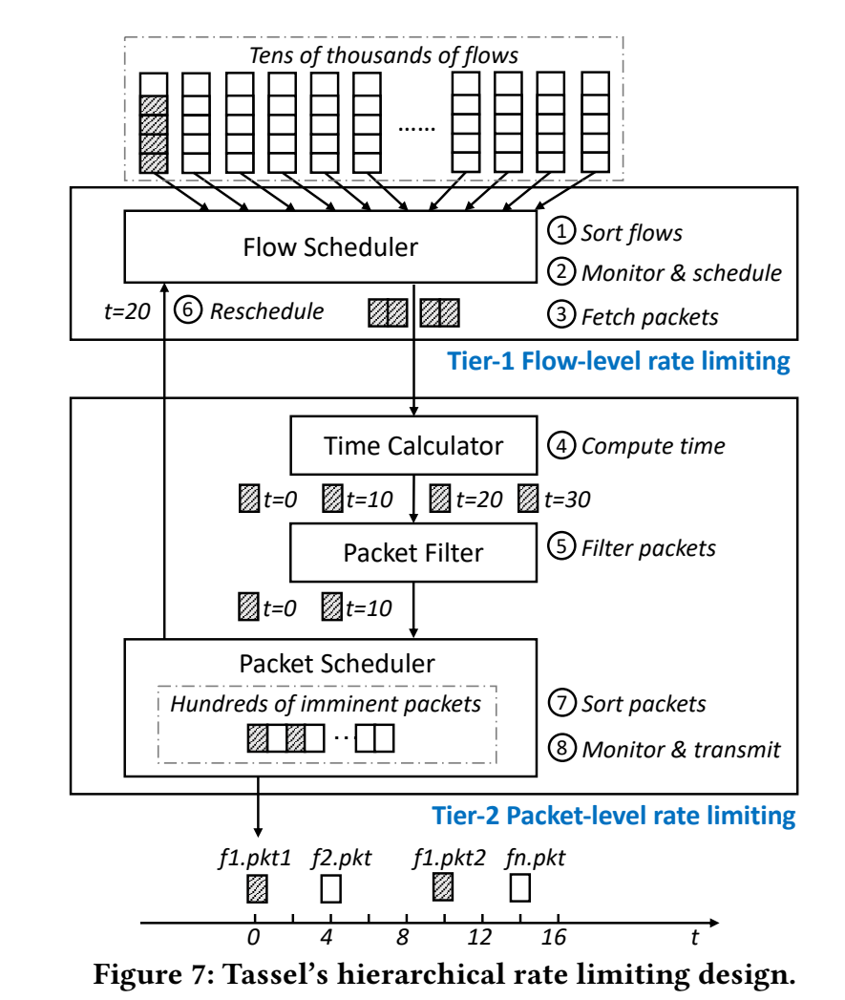

原图为 Fig.7，PDF p.6。编号 1–8 把 sort flows、monitor、fetch packets、compute time、filter、reschedule、sort packets、transmit 串成一条循环；上层处理“多但不要求每周期”的 flow，下层处理“少但必须极快”的 packet。

### 10.3 图：展示它在真实 RNIC 中插在哪里

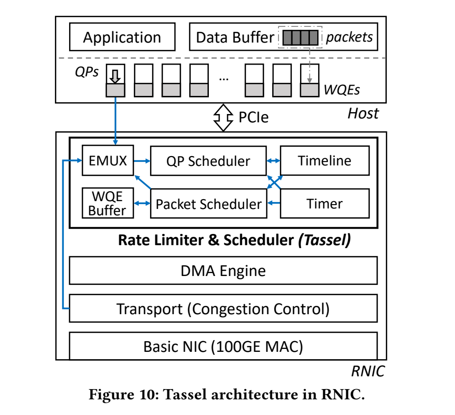

原图为 Fig.10，PDF p.8。Host QP/WQE、PCIe、rate limiter、DMA、transport 和 MAC 的层次清楚，且蓝色路径说明消息如何从 WQE 到 packet scheduler，再进入 transport。

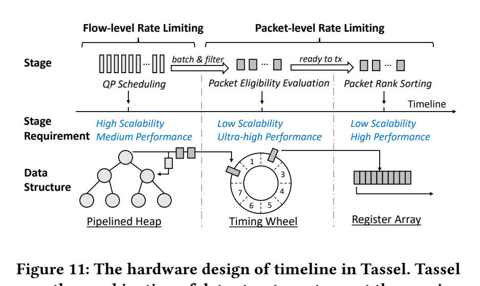

原图为 Fig.11，PDF p.9。它先列每个 stage 的 scalability/performance requirement，再把 requirement 映射到 pipelined heap、timing wheel、register array。这是一张很值得模仿的“需求 → 数据结构”设计决策图。

### 10.4 可学习的工作总结

Tassel 的关键是把一个看似统一的“排序”问题拆成不同规模和速度要求的三个 stage，不追求用一种复杂结构解决所有阶段。实验正好对应三项目标：Mpps 证明快、16K flows 和资源曲线证明可扩展、100 Kb/s–100 Gb/s 曲线证明准确。

---

## 11. RpcNIC：Enabling Efficient Datacenter RPC Offloading on PCIe-attached SmartNICs

- 会议：HPCA 2025
- 设备：PCIe-attached FPGA SmartNIC RPC accelerator
- 原文：[作者版 PDF](https://pages.cs.wisc.edu/~mgliu/papers/RpcNIC-hpca25.pdf)

### 11.1 设计逻辑链

| 环节 | 原文思路 |
|---|---|
| 设计需求 | PCIe SmartNIC 易部署，但论文平台的 PCIe 访问约 1250 ns、12.8 GB/s。逐字段反序列化会产生大量小 DMA 和 pointer chasing；若把序列化完全放 NIC，又会用慢 PCIe 访问替代快 host memcpy；RPC kernel 的结果放错内存也会增加往返。 |
| 设计原则 | RPC layer 与 transport 共同设计；按照数据最终归属选择 host/NIC memory；接收方向合并为 one-shot DMA；发送方向按 memory affinity 切分 CPU memcpy 与 NIC encoding；用 schema 描述把布局变化变成配置而非重新设计 datapath。 |
| 硬件设计 | 四路 deserializer lane 共享 Schema Table；每 lane 使用 4 KB append-only Temp Buffer，把同一 RPC 的字段聚合后一次 DMA。Target-aware Temp Deserializer 决定字段落 host 还是 NIC；Memory-affinity Serializer 让 CPU/DSA 处理 host-local copy，让 NIC 处理 encoding 和 NIC-local data；compute unit 位于可局部重配置区域。 |
| 实验闭环 | **FPGA 实测**：one-shot DMA 平均 2.2×，字段小于 1 KB 时 3.1×；memory-affinity serialization 平均节省 74% host cycles，整体 serialization time 下降 57%。image-compression 端到端吞吐相对 ProtoACC-PCIe/CPU 为 2.6×/31.8×，相对 ProtoACC-PCIe 的平均/P99 时延低 2.6×/1.9×。RpcNIC 为 170K LUT（13%）、207K registers（8%）、552 BRAM（27%）。 |

### 11.2 图：在同一张图中标数据所有权和跨 PCIe 路径

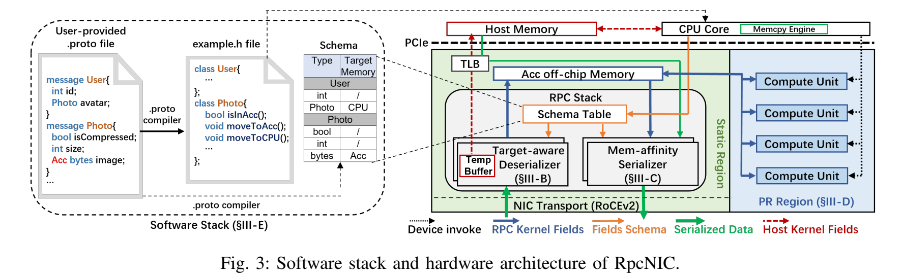

原图为 Fig.3，PDF p.5。左侧是 proto compiler/schema，右侧是设备：TLB、off-chip memory、RPC stack、schema table、target-aware deserializer、memory-affinity serializer、compute units 和 NIC transport。不同颜色区分 RPC kernel fields、host kernel fields、schema、serialized data，使“字段在哪里产生、在哪里消费”可追踪。

### 11.3 图：用三个反例/方案直接解释数据移动代价

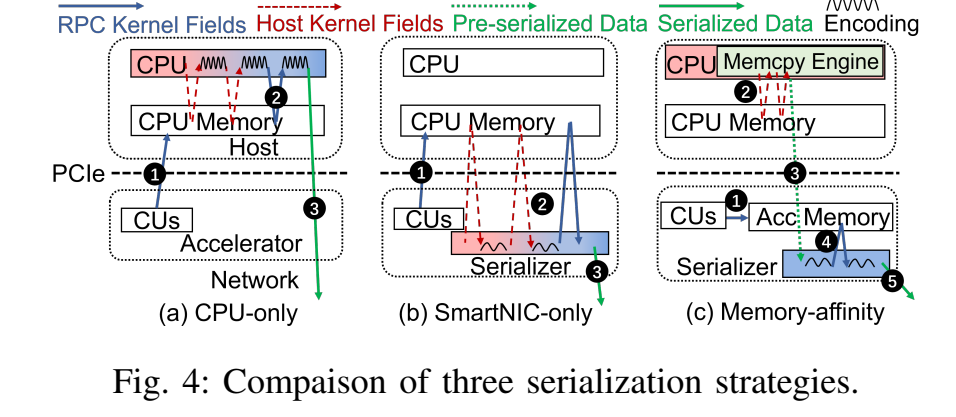

原图为 Fig.4，PDF p.5。三个并排子图固定 Host/Accelerator/Network 位置，只改变 copy 和 encoding 的执行位置。这样一张图就把设计动机从抽象的“PCIe 慢”变成了可数的跨边界箭头。

### 11.4 证据边界与总结

资源表覆盖 RpcNIC 基础设施及列出的 serializer/deserializer，不代表所有应用专用 compute kernel 的总资源。RpcNIC 最值得学习的写法是：先画出三种错误/候选数据放置，再让 one-shot DMA、target-aware placement 和 memory-affinity serializer 分别消除一类跨 PCIe 开销；每个机制都有相应微基准，最后再接端到端 workload。

---

## 12. ClubHeap：A High-Speed and Scalable Priority Queue for Programmable Packet Scheduling

- 会议：NSDI 2025
- 设备：PIFO scheduler 的 priority-queue hardware core
- 原文：[会议页](https://www.usenix.org/conference/nsdi25/presentation/chen-zhikang) ｜ [PDF](https://www.usenix.org/system/files/nsdi25-chen-zhikang.pdf)

### 12.1 设计逻辑链

| 环节 | 原文思路 |
|---|---|
| 设计需求 | PIFO 要兼顾高 packet rate、大元素数 `N`、大 priority precision `P` 和 logical partition `M`。传统 binary heap 的连续 pop/push 存在跨操作数据依赖，难以流水；线性比较结构又随 `N` 增长消耗大量 comparator。100GbE 小包要求约 148.8 Mpps。 |
| 设计原则 | 把 binary heap 的节点扩展为小 cluster；把 scheduler 中常见的 pop+push 合并成 replace；通过 cluster invariant 消除相邻操作的依赖，使不同 level 可以重叠执行。每层操作再拆成 READ、CMP、WRITE，以 CPR=1 为明确目标；浅层静态分配、深层动态分配降低浪费。 |
| 硬件设计 | 一次操作在 Cycle 1…n 逐级向下推进，而后续操作每周期进入 Level 1。每级 processor 由 READ、CMP、WRITE 和 bypass/forward mux 构成；多个 processor 连接各层 PIFO memory，浅层每个 logical PIFO 独立，深层共享 memory。 |
| 实验闭环 | **FPGA 实测/实现**：U280 原型支持最多 `2^17` elements、`2^8` logical PIFOs、32-bit priority，吞吐约 200 Mpps，覆盖 100GbE worst case。`N=2^17` 时 K=2/32 的频率约 189.57/207.25 MHz，较大 K 用更多资源换更少层数。**45 nm、800 MHz 综合**：同为 `N=2^17, P=2^16, M=1`，K=2 ClubHeap 为 4.83 mm²，BBQ 为 27.23 mm²，即 17.7%。 |

### 12.2 图：用“周期 × 层级”画出依赖如何被消除

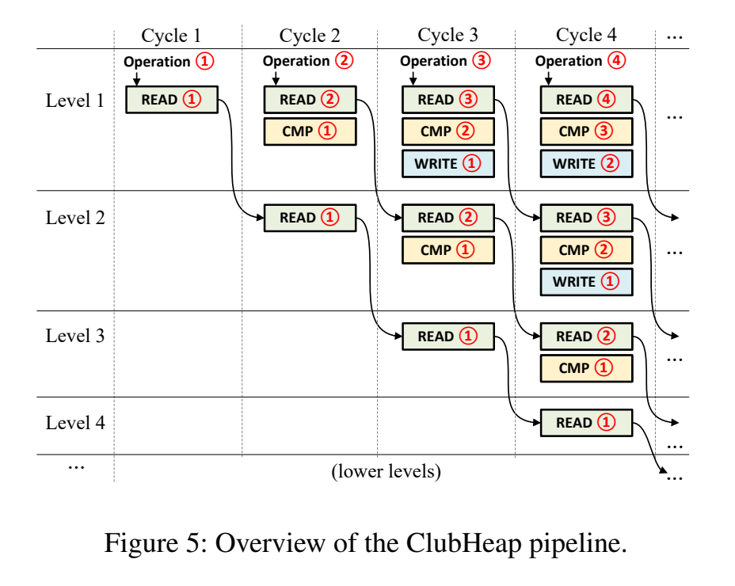

原图为 Fig.5，PDF p.6。横轴是 cycle，纵轴是 heap level；红色编号追踪不同 operation，READ/CMP/WRITE 用颜色区分。它直观证明 Operation 2 可以在 Operation 1 尚未走完整棵树时进入，而不只是口头说“fully pipelined”。

### 12.3 图：处理器内部和 memory mapping 分开画

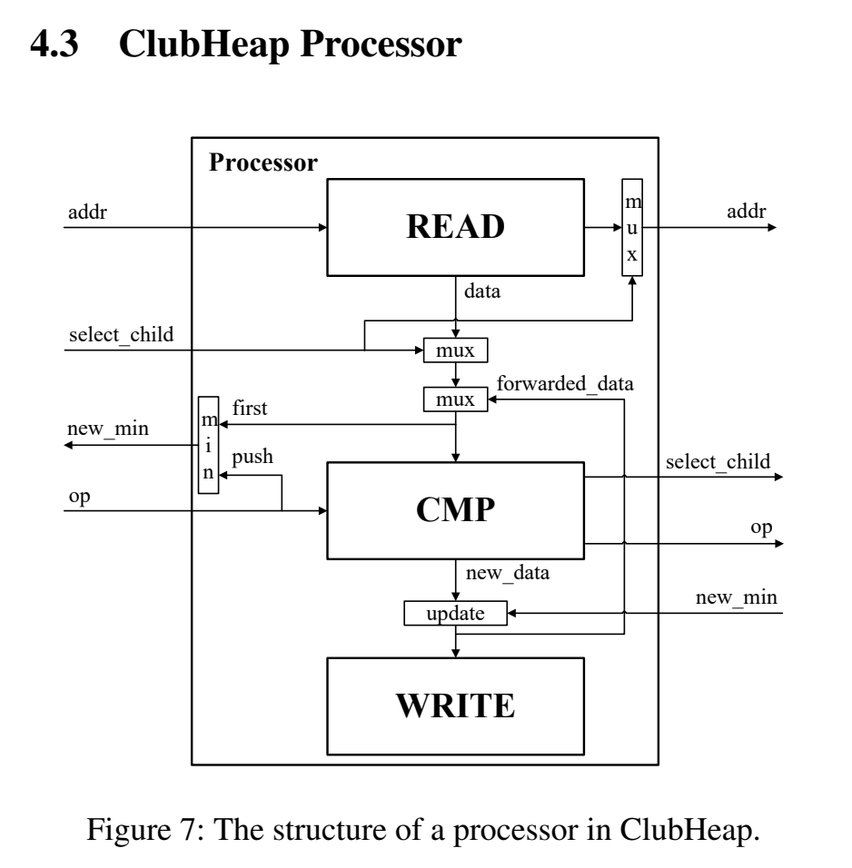

原图为 Fig.7，PDF p.8。READ、CMP、WRITE、forwarded data、select_child、new_min、update 信号完整展示了单级 datapath。

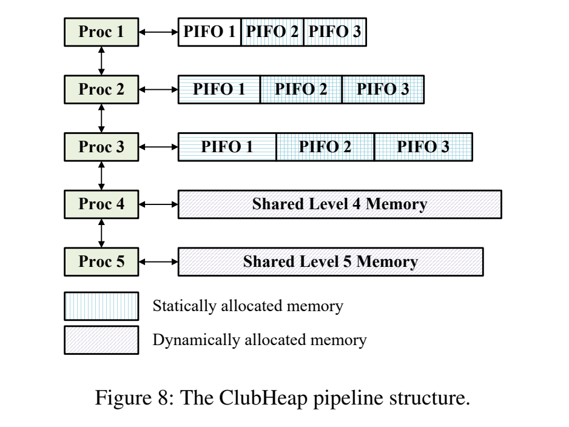

原图为 Fig.8，PDF p.9。上层 PIFO 静态划分、深层共享动态 memory 的资源策略直接画在 processor 层级旁边，连接了时序结构和容量结构。

### 12.4 证据边界与总结

ClubHeap 是 scheduler 核心而不是完整交换芯片；200 Mpps 是 FPGA priority-queue prototype，4.83 mm²/17.7% 是 45 nm ASIC 综合，两者不能混成一套硅片实测。它最值得模仿的是从“跨操作依赖”这个阻断流水的根因出发，用不变量重构数据结构，再画出 cycle-level overlap、单级 datapath 和全局 memory mapping 三张互补图。

---

## 13. RoCE BALBOA：Service-Enhanced RDMA Offload Engine for Data Center SmartNICs

- 会议：OSDI 2026
- 设备：开放、可扩展、100G RoCEv2 FPGA offload engine
- 原文：[会议页](https://www.usenix.org/conference/osdi26/presentation/heer) ｜ [PDF](https://www.usenix.org/system/files/osdi26-heer.pdf)

### 13.1 设计逻辑链

| 环节 | 原文思路 |
|---|---|
| 设计需求 | 原文明确定义 R1：100G 且可升级 200G；R2：严格 RoCEv2 兼容并可与商用 NIC/交换机互操作；R3：低资源、低功耗、为应用 offload 留空间；R4：开放、模块化、可插协议增强。现有开源栈常在性能、完整协议和可扩展性之间取舍。 |
| 设计原则 | 采用 512-bit AXI4-Stream@250 MHz，提供 128 Gb/s 内部带宽余量；header 按协议层纵向拆，RX/TX 横向拆；data/control/completion stream 分离；状态表放 dual-port BRAM，避免 RX/TX 互锁；每个模块深流水并使用标准接口。 |
| 硬件设计 | 完整栈包含 host/GPU DMA、connection setup、arbitration、RX/TX header processing、payload extraction、flow control、retransmission、HBM buffer、ICRC 和多个 on-path/parallel-path/application-offload slot。关键 building block 包括 ACK-clocked flow control、独立 HBM retransmission datapath 和并行 ICRC pipeline。 |
| 实验闭环 | **FPGA 实测**：与商用 NIC 互操作并达到 100G saturation；AES 保持 full rate，只增加 11 cycles/44 ns；MTU retransmission 从触发到完整发出约 1.86 μs。**post-route/工具估计**：BALBOA 基础栈 43,732 LUT（3.4%）、101 BRAM（5.1%）、102,988 FF（4%）、1.745 W；相同条件下 LUT 比 Limago 低 18%。AES+ML-DPI 后总 LUT 仍低于 12.15%。设计可闭合到 400 MHz，因此作者指出 200G 升级路径，但未实测 200G。 |

### 13.2 图：复杂协议栈也要保持可追踪路径

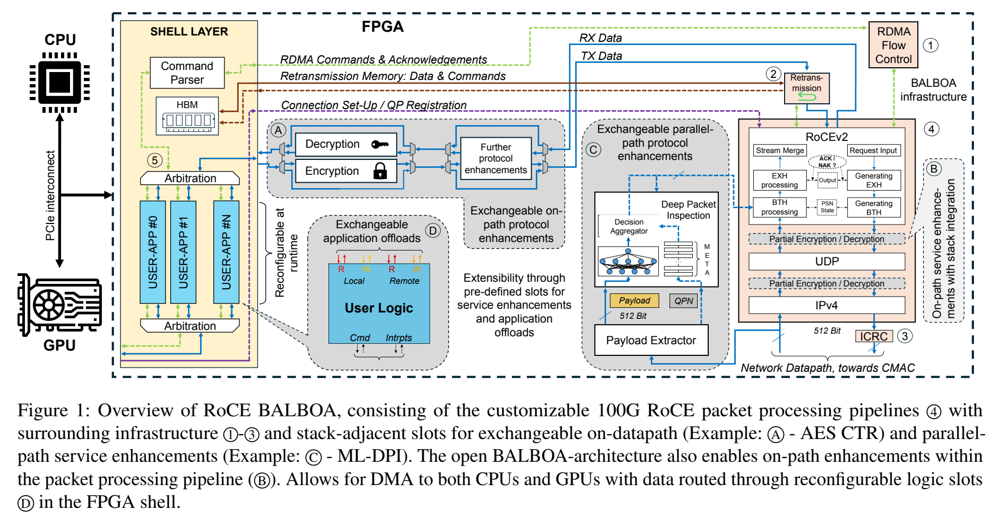

原图为 Fig.1，PDF p.6。这是本报告中最接近用户参考图风格的一张：CPU/GPU、shell、DMA、协议 pipeline、状态/重传 memory、ICRC、arbitration 和可替换 offload slot 都在同一张图中。蓝/绿路径区分 RX/TX data，编号 1–5 标基础设施，A–D 标可扩展位置。

复杂总图仍然可读的原因有三点：

1. 先用大虚线框划系统边界，再在边界内分区；
2. 基础协议、可替换 enhancement、application offload 使用不同底色；
3. 外部 CPU/GPU/HBM 连接只在对应接口处进入，不让箭头任意穿越全图。

### 13.3 图：只挑决定 line rate 的关键模块下钻

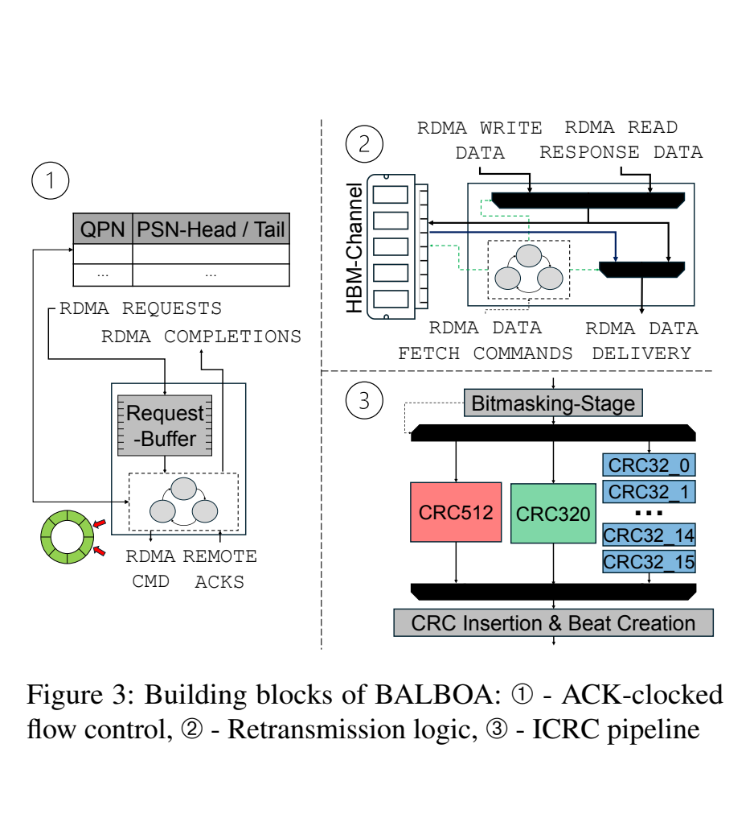

原图为 Fig.3，PDF p.8。它没有下钻所有模块，而是选择最影响协议正确性和 line rate 的三个 block：QPN/PSN 状态与 request buffer、HBM fetch/delivery、bitmasking + 多路 CRC。每个 block 都能和总图中的编号对应。

### 13.4 证据边界与总结

1.745 W 是 FPGA 工具的 post-route 功耗估计，不是板上独立测得的芯片功耗；400 MHz 是 timing closure，不等于已经演示 200G。BALBOA 的强项是让 R1–R4 分别落到 bus width/clock、协议模块、资源表和标准接口/slot，并用模块级资源与功耗说明每种协议能力的成本。

---

## 14. 跨论文总结：一条可复用的硬件设计逻辑链

### 14.1 从“系统慢”继续追问到“哪一种硬件资源不匹配”

这些论文的需求都不是泛泛的“CPU 太慢”：

| 表面问题 | 被定位出的硬件根因 | 代表论文 |
|---|---|---|
| 推理延迟高 | PCIe 搬运、batching、模型表示不适合位级硬件 | N3IC |
| 交换机状态放不下 | SRAM 容量/插入率与 connection table 不匹配 | Tiara |
| 数据面不会做 ML | MAT/VLIW 缺少规则乘加和 loop，外接又增加延迟 | Taurus |
| 多租户互相干扰 | 空间数据流资源没有 module-aware partition/overlay | Menshen |
| QP 多时吞吐坍塌 | WQE/QPC/bitmap/reorder 状态挤占片上 SRAM | SRNIC |
| collective 难改 | schedule 经常变，数据移动 primitive 相对稳定 | ACCL+ |
| RoCE multicast 失效 | one-to-one QP 状态与 many-to-one feedback 不匹配 | Cepheus |
| pipeline/RTC 二选一 | 固定资源比例与应用的计算/状态比例不匹配 | OptimusPrime |
| rate limiter 不够快 | 每次全 flow 排序却只发送一个 packet | Tassel |
| RPC offload 仍慢 | 大量小 PCIe DMA、错误的数据/计算放置 | RpcNIC |
| heap 不能每周期入操作 | 相邻 pop/push 有跨操作数据依赖 | ClubHeap |
| 开源 RoCE 难扩展 | 协议状态、重传、CRC 和 offload 接口强耦合 | BALBOA |

可模仿的需求写法是：给出**目标速率/时延/规模**，列出当前结构中对应的**容量、访问次数、关键路径或数据移动次数**，再指出两者的数量级缺口。

### 14.2 设计原则通常来自四类“不对称性”

1. **常见路径 vs 罕见路径**：SRNIC 把顺序包留硬件、OOO metadata 放软件；Tiara 把 fast path 与 slow path 分开。
2. **稳定机制 vs 经常变化的策略**：ACCL+ 的 data movement hardware + uC schedule；BALBOA 的标准 stream + 可替换 offload slot。
3. **大规模低频对象 vs 小规模高频对象**：Tassel 的 flow/packet 两级；ClubHeap 的浅层独占、深层共享。
4. **数据所在位置 vs 计算所在位置**：RpcNIC 按 memory affinity 分工；Tiara 按 HBM/ASIC/x86 原生能力分工。

设计原则不要写成“高性能、低开销、可扩展”三个口号，而应写成能直接约束模块边界的句子，例如：

> 只有顺序 common path 在 NIC 内全硬件执行；所有需要大 bitmap 的异常状态驻留 host memory，通过有界 metadata queue 交互。

### 14.3 每条原则必须能在图中找到一个模块或一条路径

推荐建立如下映射表后再画图：

| 原则 | 图中应出现的实体 | 验证它的实验 |
|---|---|---|
| 控制/数据分离 | 两种颜色、独立 queue/interface、合流点 | 吞吐 + 控制切换/算法更新 |
| fast/slow path | 明确分叉条件、slow-path queue、返回路径 | common-case 时延 + 异常比例/丢包测试 |
| 状态外置/分层 | SRAM/HBM/host memory、cache/table、DMA | 容量账本 + hit/带宽/PCIe 开销 |
| 并行/流水 | stage 边界、寄存器、lane、每周期操作 | clock、Mpps、关键路径或 CPR |
| 模块复用 | 共享 datapath、mode-specific 控制、互连 | 面积/资源增量 + 多 workload |
| 可扩展接口 | adapter/slot、标准 stream、命令/应答 | 新协议/新 kernel + 额外资源 |

### 14.4 实验应形成四层证据金字塔

1. **单模块微基准**：lookup、DMA、sort、CRC、executor latency；
2. **整条 datapath**：Gb/s、Mpps、端到端 latency、loss/reordering；
3. **资源和能效**：LUT/FF/BRAM/DSP、ASIC mm²、功耗，并明确工具/工艺；
4. **应用闭环**：DLRM、MPI_Bcast、HPL、RPC service、load balancer 等。

最好再加一项**反事实或消融**：P4 vs native BNN、pure pipeline vs transformable、field-by-field vs one-shot DMA、monolithic vs hierarchical limiter。这样性能优势能被归因到具体设计，而不是只证明“新系统能跑”。

---

## 15. 候补论文与未进入主清单的原因

这些工作同样值得读，但为避免重复或保持“领域定制硬件”主线，没有逐篇展开：

| 论文 | 会议 | 图的情况 | 未进主清单的原因 |
|---|---|---|---|
| Rosebud: Making FPGA-Accelerated Middlebox Development More Pleasant | ASPLOS 2023 | framework、RPU memory、packet/control flow 都很清晰 | 更偏开发框架；与 ACCL+/BALBOA 的模块化叙事重复 |
| High-throughput and Flexible Host Networking for Accelerated Computing（ZeroNIC） | OSDI 2024 | 有 NIC block diagram、send/receive path、cursor logic | 强调软硬件路径分离，专用 compute module 较少 |
| Queue-Mem | NSDI 2026 | Fig.5 的 ASIC ingress/egress、queue/controller 数据流很清楚 | 主要复用现有 ASIC queue/PFC primitive，不是新增定制硬件模块；因此不是因“没有周期级图”而排除 |
| Falcon: A Reliable, Low Latency Hardware Transport | SIGCOMM 2025 | requirements→principles 和 transport layer 图很好 | 公开论文图更偏层级架构，模块下钻/资源成本弱于 SRNIC、BALBOA |
| Sifter | NSDI 2024 | Mini-PIFO/RCQ 和 VHDL block diagram 很清晰 | 与 ClubHeap 同属 scheduler；主清单保留更新且有 2025 ASIC/FPGA 双证据的 ClubHeap |
| RingLeader | NSDI 2023 | NIC request scheduler、reduction tree 和端到端数据流清晰 | 与 SRNIC/Tassel 的 NIC scheduler 主题重叠 |
| FPISA | NSDI 2022 | MAU stage 中的数据表示变化非常适合学习 | 更偏新增浮点 primitive；主清单已由 Taurus/Menshen 覆盖交换流水线 |

---

## 16. 最终记忆版：每篇工作一句话

- **N3IC**：先选与位级硬件匹配的 BNN，再把一层拆成 XOR/popcount/sign 三级流水。
- **Tiara**：按带宽、容量、控制复杂度把 LB 任务映射到 Tofino、FPGA+HBM、x86。
- **Taurus**：用受限但覆盖应用族的 MapReduce/SIMD block 填补交换机逐包 ML 的表达能力缺口。
- **Menshen**：可切资源 partition，不可切资源 overlay，让 module ID 驱动全流水隔离。
- **SRNIC**：先做片上状态账本，再用 host memory、协议 metadata 和无缓存调度逐项“消表”。
- **ACCL+**：把常变 schedule 留给固件，把稳定高速 data movement 做成并行硬件 primitive。
- **Cepheus**：保持 endpoint RoCE 不变，在网络内完成连接桥接、复制和反馈聚合。
- **OptimusPrime**：复用 pipeline/RTC 的公共 datapath，用少量控制和三种简单路径动态分配角色。
- **Tassel**：大规模 flow 粗调度、小规模 imminent packet 精排序，避免“全排序只发一包”。
- **RpcNIC**：计算跟着数据位置走，把小 PCIe 访问合并成 one-shot DMA。
- **ClubHeap**：先用数据结构不变量消除跨操作依赖，再实现每周期进入的新操作流水。
- **BALBOA**：把 RoCE 协议能力拆成标准 stream 模块，并用 slot、资源和功耗表证明可扩展性有成本边界。

如果要模仿其中的论文组织方式，最简洁的写法是：

> 用一个可量化瓶颈定义需求；从路径、状态或访问模式的不对称性提炼 3–5 条原则；让每条原则在总体图中对应一个模块/接口，在细节图中对应一个 datapath 或数据结构；最后用模块微基准、整机性能、资源/面积/功耗和端到端应用四层实验逐项闭环。
